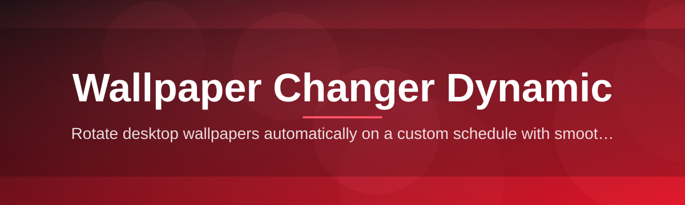
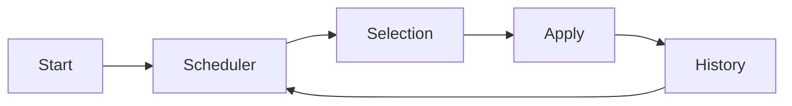

# wallpaper-changer-dynamic-controller 🖼️🌗

  

*Your desktop, tuned to the clock, the weather, and your mood — automatically.*

  

## 🌅 Overview

**wallpaper-changer-dynamic-controller** is a lightweight Windows utility built for one purpose: making your desktop background behave like a living surface instead of a static image pinned to your screen since the day you installed your OS. It cycles, blends, and schedules wallpapers based on rules you define — time of day, sunrise and sunset, folder rotation, or a fixed interval — so your desktop quietly evolves without you lifting a finger.

The idea behind "dynamic" wallpaper management isn't new, but most solutions either lock you into a single ecosystem, demand a background service you can't inspect, or bury simple settings under layers of bloat. This controller takes the opposite approach: a small, transparent, standalone application that does the scheduling logic itself, gives you visible control over every rule, and steps out of the way once configured.

It's built for people who spend hours at their desktop and want that environment to feel less static — designers who rotate mood boards, night-shift workers who want dark scenery after dusk, or anyone who simply likes their wallpaper folder to actually get *used*. If you've ever set a wallpaper once and forgotten it existed for two years, this tool exists to fix that.

---

## 🔁 Before & After

| | Static Setup (Before) | Dynamic Controller (After) |
|---|---|---|
| **Wallpaper behavior** | Fixed image, changed manually | Rotates on schedule, sunrise/sunset, or interval |
| **Multi-monitor** | Same image forced on every display | Per-monitor assignment supported |
| **Folder usage** | One image picked, rest ignored | Entire folder cycled automatically |
| **Time awareness** | None | Adjusts by time-of-day or daylight |
| **Resource footprint** | N/A (nothing running) | Minimal — one lightweight background process |
| **Setup effort** | Manual, repeated forever | Configure once, runs indefinitely |

> [!NOTE]
> The comparison above reflects typical manual wallpaper habits versus the controller's default scheduling profile. Every rule shown is adjustable — nothing is hardcoded.

---

## ⚡ What It Actually Does

1. **Interval-based rotation** — set a fixed cadence (minutes, hours, or days) and the controller cycles through a chosen folder without repeats until the pool is exhausted.

2. **Daylight-aware switching** — link wallpaper changes to sunrise and sunset using your system clock and location offset, so mornings and evenings look different by design.

3. **Per-monitor assignment** — multi-display setups get independent wallpaper tracks instead of one image stretched or duplicated across screens.

4. **Folder watching** — drop new images into a monitored folder and the rotation pool updates without restarting the app.

5. **Transition blending** — switches use a short crossfade rather than an abrupt pop, keeping changes visually calm.

6. **Manual override controls** — skip forward, pause rotation, or pin a favorite image indefinitely, all from the tray menu.

7. **History and favorites** — recently shown wallpapers are logged, and any image can be starred to weight it into future rotations.

8. **Lightweight footprint** — a single background process, no telemetry, no bundled runtime installers.

9. **Portable configuration** — settings are stored in a local file you can back up, copy, or sync across machines.

10. **Theme-aware interface** — the controller's own window follows light or dark mode based on your Windows theme setting.

> [!TIP]
> Combine folder watching with daylight-aware switching to build a "morning" and "evening" set that refreshes itself as you add images — no manual re-sorting required.

---

## 🚀 How To Get Started

1. **Visit the landing page** using the download button above or below.

2. **Download the application** — it ships as a standalone executable, no installer wizard required.

3. **Run it once** — the controller will detect your default wallpaper folder or prompt you to pick one.

4. **Set your rules** — choose interval, daylight, or folder-watch mode from the tray icon, then let it run in the background.

> [!IMPORTANT]
> No accounts, no sign-in, no cloud sync. All scheduling and configuration happens locally on your machine.

---

## 🧩 System Requirements

| Component | Requirement |
|---|---|
| **OS** | Windows 10 (64-bit) or Windows 11 |
| **Dependencies** | None — fully standalone binary |
| **Disk space** | Under 50 MB |
| **Memory** | Minimal — runs as a single background process |
| **Network** | Not required after download |

  

---

## 🛠️ How It Works

1. **Startup** — the controller loads your saved configuration or applies sensible defaults on first run.

2. **Scheduler tick** — an internal timer checks whether the current rule (interval, daylight, or folder event) has been triggered.

3. **Selection** — the next wallpaper is picked from the active rotation pool, respecting favorites and history to avoid repeats.

4. **Application** — the new image is applied to Windows via the display settings, with a brief crossfade transition.

5. **Log & wait** — the change is recorded in history, and the scheduler returns to idle until the next trigger.

> [!NOTE]
> The scheduler loop is the only long-running component. Everything else — the settings window, the tray menu — is opened on demand and closes without leaving residual processes.

---

## 🩹 Troubleshooting

<strong>The wallpaper isn't changing at the scheduled time.</strong>

Check that the app is still running in the system tray — some Windows power plans suspend background apps aggressively. Re-open the tray icon and confirm the scheduler status reads "active."

<strong>Sunrise/sunset mode shows the wrong times.</strong>

This mode relies on your system clock and region settings. Confirm your Windows time zone is correct, then reopen the daylight settings panel to recalculate.

<strong>One monitor isn't updating in multi-display mode.</strong>

Open per-monitor assignment and verify each display has its own rotation pool selected. A display left unassigned will simply keep its last wallpaper.

<strong>New images dropped into the folder aren't appearing.</strong>

Folder watching checks for changes on a short delay. If the folder is on a network drive, watching may be unreliable — local folders are recommended.

<strong>The app won't start after a Windows update.</strong>

Re-download the latest build from the landing page. Windows updates occasionally reset background app permissions that the controller depends on.

<strong>Transitions feel abrupt instead of smooth.</strong>

Crossfade duration is adjustable in settings. If your GPU driver is outdated, transitions may render less smoothly regardless of the configured duration.

---

## 🎛️ Interface & Interaction

**Keyboard shortcuts:**

- `Ctrl + Right` — skip to next wallpaper immediately
- `Ctrl + Left` — return to previous wallpaper
- `Ctrl + Space` — pause or resume rotation
- `Ctrl + F` — favorite the current wallpaper

**Themes:**

- Follows Windows light/dark mode automatically
- Manual override available in settings for a fixed theme

**Settings panel covers:**

- Rotation mode (interval / daylight / folder-watch)
- Per-monitor wallpaper pools
- Transition duration and style
- History length and favorites weighting

> [!WARNING]
> Disabling history logging will also disable the "avoid repeats" behavior — rotation may show the same image more often as a result.

---

## 🤝 Contributing & Community

Issues, feature requests, and pull requests are welcome. Before opening an issue, check that it isn't already tracked — duplicate reports slow down triage for everyone.

1. Fork the repository.

2. Create a focused branch for your change.

3. Keep commits small and descriptive.

4. Open a pull request with a clear summary of what changed and why.

> [!TIP]
> Discussions about new scheduling modes or UI ideas are best opened as a discussion thread first — it helps shape the feature before code is written.

---

## 📄 License

Released under the [MIT License](LICENSE), 2026.

---

## ⚠️ Disclaimer

This tool modifies your desktop wallpaper settings through standard, documented Windows APIs. It does not collect personal data, does not phone home, and does not modify any files outside the folders you explicitly configure. Use it at your own discretion, and always keep backups of custom wallpaper collections you value.

